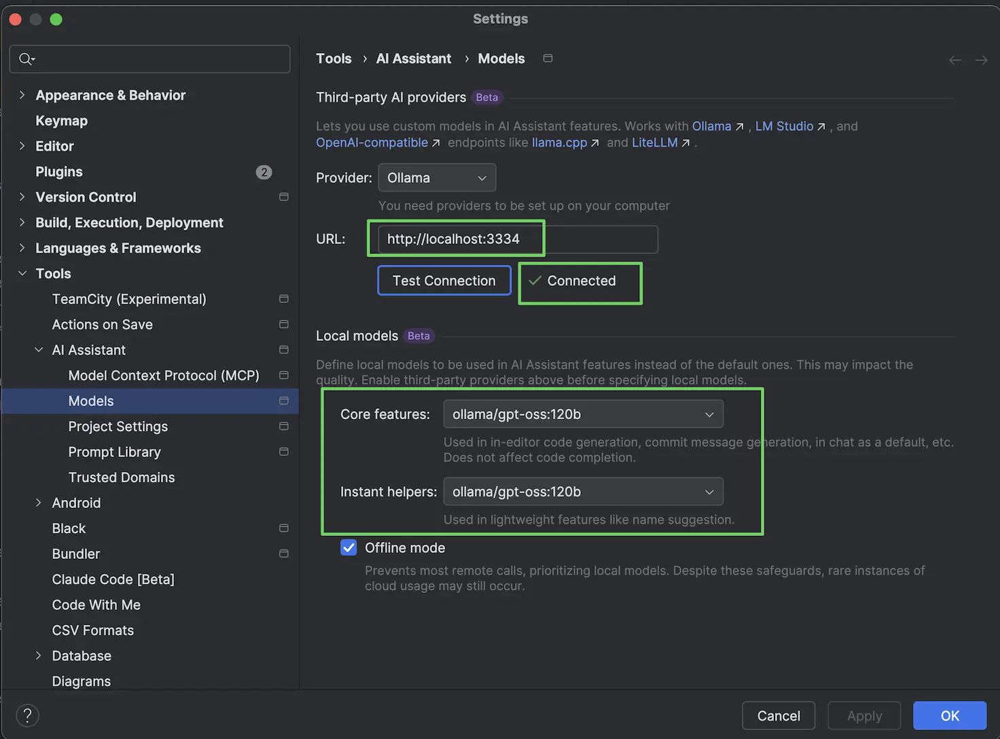

Ever dreamt of accessing on your remote server an IDE using a local LLM tool... running a remote LLM just for the sake of AIception?

Well, considering how much time it took to answer locally on my M4 Max 64 GB of RAM...

https://github.com/user-attachments/assets/91eae390-e1d7-45bf-a724-62b13fc281a5

and that's `gpt-oss-20b`...

## The Problem

Ollama's new Turbo subscription provides access to powerful remote models like `gpt-oss-120b` and `gpt-oss-20b`, but most IDEs and AI tools expect OpenAI's API format. This server solves that by:

- **Providing OpenAI-compatible API** that tools recognize
- **Exposing remote Turbo models** through familiar OpenAI format
- **Providing blazing fast performance** through Ollama's Turbo infrastructure
- **Enabling seamless integration** with any OpenAI-compatible tool

## Setup

1. **Install dependencies:**
```bash
bun install
```

2. **Get your Ollama Turbo API key:**
   - Sign up for Ollama Turbo subscription
   - Get your API key from the Ollama dashboard https://ollama.com/settings/keys

3. **Set up environment:**
```bash
cp .env.example .env
```
and then edit the `OLLAMA_API_KEY` var env with your key.

4. **Start the server:**
```bash
# Start the OpenAI-compatible server
bun run openai

# Development with auto-reload
bun run openai:dev
```

## Environment Variables

- `OLLAMA_API_KEY` - Your Ollama Turbo API key (required)
- `OLLAMA_HOST` - Ollama Turbo host (default: https://ollama.com) - ⚠️ changing this will disable Turbo mode
- `OPENAI_PORT` - Server port (default: 3304)

## Final result?

Yeah, you're not dreaming, this video is `1x` 😄

https://github.com/user-attachments/assets/aed9ecb2-95e3-4a64-a6ed-6bc1a7eafb07

But still a systematic error occurs... Almost there.

And way better than the non-existing ChatGPT API that charges the same 20$/month 😄

## Available Models

This server exposes the following Ollama Turbo models via OpenAI API:

- **gpt-oss:120b** - Large model for complex tasks, code generation
- **gpt-oss:20b** - Smaller model for quick responses, suggestions

⚠️ Not supported yet:
- Agentic features
- Web browsing and tool capabilities

## IDE Integration

### JetBrains AI

1. **Start the server:** `bun run openai`
2. **In JetBrains IDE:**
   - Go to Settings → AI Assistant → Provider
   - Select "OpenAI" as provider
   - Set Base URL to: `http://localhost:3304/v1`
   - Set API Key to: `any-key` (not required, but field must be filled)
   - Click "Test Connection" ✅
3. **Select models:**
   - Core features: `gpt-oss:120b` (for code generation, commit messages)
   - Instant helpers: `gpt-oss:20b` (for quick suggestions)



### VS Code with AI Extensions
Configure your AI extension to use:
- Base URL: `http://localhost:3304/v1`
- API Key: `any-key`

### Cursor
1. Go to Settings
2. Find AI Provider settings
3. Set Custom OpenAI API URL to: `http://localhost:3304/v1`
4. Set API Key to: `any-key`


## API Usage Examples

```bash
# List available models
curl -X GET http://localhost:3304/v1/models

# Chat completion (non-streaming)
curl -X POST http://localhost:3304/v1/chat/completions \
  -H "Content-Type: application/json" \
  -d '{
    "model": "gpt-oss:20b",
    "messages": [
      {"role": "user", "content": "Hello!"}
    ]
  }'

# Chat completion (streaming)
curl -X POST http://localhost:3304/v1/chat/completions \
  -H "Content-Type: application/json" \
  -d '{
    "model": "gpt-oss:120b",
    "messages": [
      {"role": "user", "content": "Write a short story"}
    ],
    "stream": true
  }'
```

## Compatibility

Works with any tool that supports OpenAI API:
- ✅ **JetBrains AI Assistant**
- ✅ **VS Code AI Extensions**
- ✅ **Cursor IDE**
- ✅ **Any OpenAI-compatible application**

## Performance

Thanks to Ollama's Turbo infrastructure:
- ⚡ **Blazing fast responses** (much faster than local models)
- 🚀 **No local GPU required** 
- 💾 **No model downloads** (instant startup)
- 🌐 **Cloud-powered inference**


